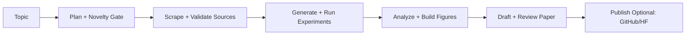
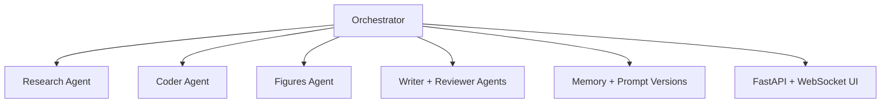
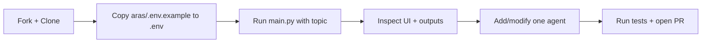

# ARAS: Idea-to-Paper Autopilot

ARAS (Autonomous Research Agent System) is an end-to-end research automation framework that turns a topic into experiments, analysis, figures, and a publication-style paper with a live web UI.

It is built for practical, reproducible AI research workflows: evidence-gated novelty checks, runnable experiment generation, paper drafting, review loops, persistent memory, and optional publishing.

## How it works





## Why ARAS

- Multi-agent orchestration for the full research lifecycle (plan -> scrape -> code -> run -> analyze -> write -> review -> publish)
- Real-time FastAPI + WebSocket UI for pipeline status and logs
- Provider fallback routing (local models, NVIDIA, OpenAI) with retries and graceful degradation
- Persistent memory with ChromaDB + prompt versioning for iterative self-improvement
- Safety gates for novelty pivots, figure quality, approval checks, and budget ceilings

## Core capabilities

- **Research planning and novelty checks** with strict evidence gating
- **Automated scraping and citation validation** (including Crossref enrichment)
- **Experiment code generation and execution** with rerun and recovery logic
- **Figure generation and quality filtering** for paper-ready outputs
- **Paper drafting and review loops** (LaTeX-first pipeline)
- **Optional publishing integrations** for GitHub and Hugging Face

## Project layout

- `aras/` main source package (agents, orchestrator, UI, config, models, memory)
- `tests/` unit, API, network, and integration tests
- `paper/` paper workspace (figures/diffs folders tracked; generated files ignored)
- `experiments/` experiments workspace (folder tracked; generated content ignored)
- `logs/` runtime logs and quality ledgers (ignored by git)

## Build on ARAS (quick path)



- Add a new capability by extending an agent in `aras/agents/`.
- Keep paths/config centralized in `aras/config.py`.
- Validate changes with `pytest -v` before opening a PR.

## Quick start

### Prerequisites

- Python 3.12+
- Git
- Optional: Docker + Docker Compose

### Windows (PowerShell)

```powershell
py -m venv .venv
.\.venv\Scripts\Activate.ps1
py -m pip install -U pip
py -m pip install -r .\aras\requirements.txt
Copy-Item .\aras\.env.example .\.env
py .\aras\main.py --topic "Autonomous Research Agents"
```

### Linux/macOS

```bash
python3 -m venv .venv
source .venv/bin/activate
python3 -m pip install -U pip
python3 -m pip install -r aras/requirements.txt
cp aras/.env.example .env
python3 aras/main.py --topic "Autonomous Research Agents"
```

Open `http://127.0.0.1:8000`.

### Docker

From `aras/`:

```bash
docker-compose up --build
```

## Configuration

Environment variables are documented in `aras/.env.example`.

Important keys:

- `OPENAI_API_KEY`, `NVIDIA_API_KEY`
- `GITHUB_TOKEN`, `GITHUB_OWNER`
- `HF_TOKEN`, `HF_USERNAME`
- `CROSSREF_EMAIL`
- `APPROVAL_WEBHOOK_URL`, `APPROVAL_TIMEOUT_SECONDS`

## Security and secrets policy

This repository follows a strict no-secrets rule:

- Never commit real API keys, tokens, passwords, or private keys.
- Use `.env` locally only; template values belong in `.env.example`.
- If a secret is accidentally exposed, rotate it immediately and remove it from git history before publishing.
- Secrets and runtime artifacts are ignored via `.gitignore`.

See `SECURITY.md` for disclosure and hardening guidance.

## Testing

```bash
pytest -v
```

## Open-source metadata

- License: `MIT` (`LICENSE`)
- Contributing guide: `CONTRIBUTING.md`
- Security policy: `SECURITY.md`

## Acknowledgment

ARAS is designed as a practical research copilot for fast experiment cycles and transparent, artifact-backed results.
